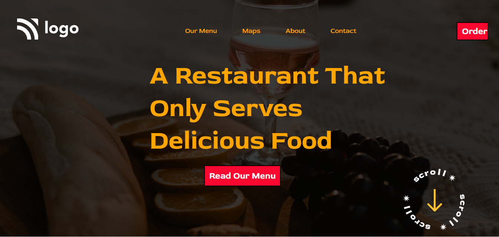

# Project 1 HTML and CSS

# [Link of live Project]()

# What I learnt here from this project

- I have very good experience from developing this awosome web project.
- I have learnt more about Html and Css.
- I use z-index to position of the image and square.

# How many time to take develop this web page.

- Almost 5 hours is spent by my side to make